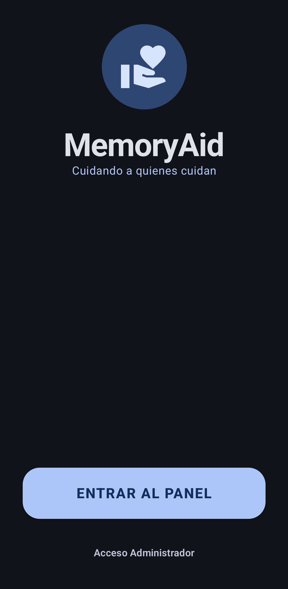
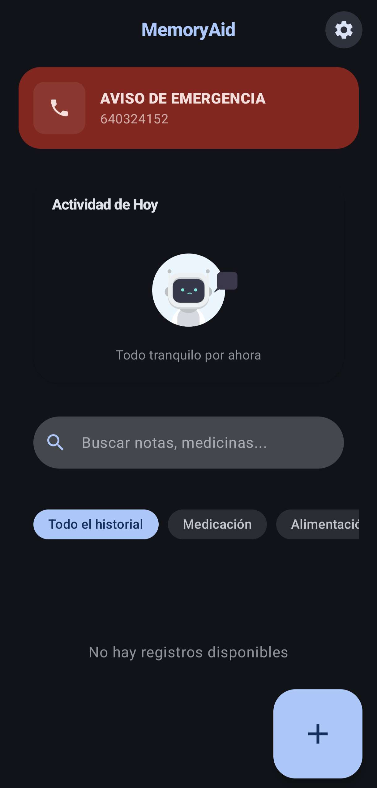
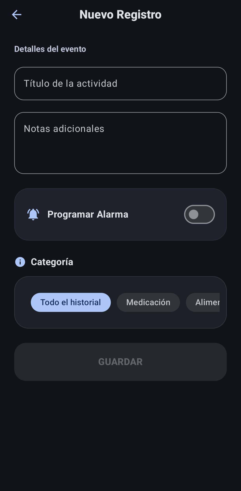
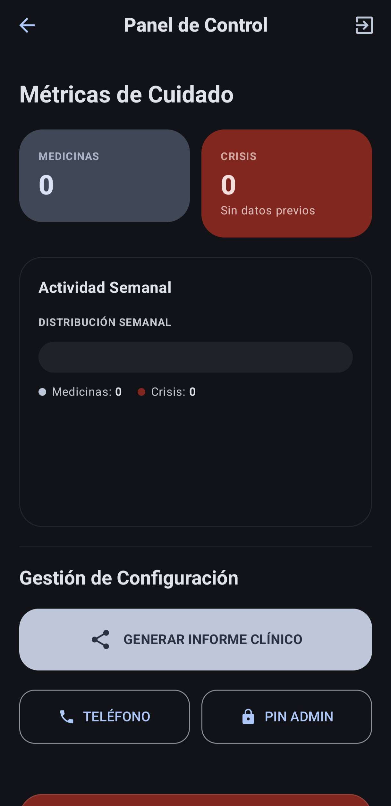

# MemoryAid

MemoryAid es una solución móvil avanzada orientada a la asistencia de cuidadores y personas con necesidades de soporte cognitivo. La plataforma permite centralizar el registro de eventos críticos, la gestión de medicación y el seguimiento de actividades diarias mediante una interfaz optimizada para la usabilidad y la accesibilidad sensorial.

---

## Descarga e Instalación Directa

Para facilitar la evaluación del proyecto sin necesidad de configuración previa del entorno de desarrollo, puede descargar el paquete ejecutable directamente:

**[Descargar MemoryAid APK v1.0.0](https://github.com/JoseLuis-S/MemoryAid/releases/tag/v1.0.0)**

*Nota: La instalación requiere habilitar el permiso de orígenes desconocidos en el dispositivo Android.*

---

## Galería de la Aplicación

|                  Inicio                  |        Panel de Control         | Registro de Actividad |    Panel de administrador    |
|:----------------------------------------:|:-------------------------------:| :---: |:----------------------------:|
|            |  |  |  |

---

## Documentación Detallada

El proyecto cuenta con documentación específica organizada por objetivos para guiar la revisión técnica:

* **[Manual de Proyecto](docs/MANUAL.md)**: Incluye la guía de usuario, requisitos técnicos, diagramas de arquitectura y especificaciones del sistema de notificaciones y persistencia.
* **[Justificación de Criterios](docs/CRITERIOS.md)**: Documento técnico que vincula la implementación con la rúbrica de evaluación, justificando las decisiones de diseño y arquitectura.

---

## Stack Tecnológico y Arquitectura

La aplicación se ha desarrollado siguiendo estándares de calidad profesional y principios de Clean Architecture:

* **Lenguaje:** Kotlin
* **Interfaz de Usuario:** Jetpack Compose (Material Design 3)
* **Arquitectura:** Model-View-ViewModel (MVVM)
* **Inyección de Dependencias:** Hilt
* **Persistencia de Datos:** Room Database con flujos reactivos (Kotlin Flow)
* **Tareas en Segundo Plano:** WorkManager para la gestión de alarmas y recordatorios
* **Componentes Visuales:** Lottie (Animaciones) y Canvas (Gráficos personalizados)